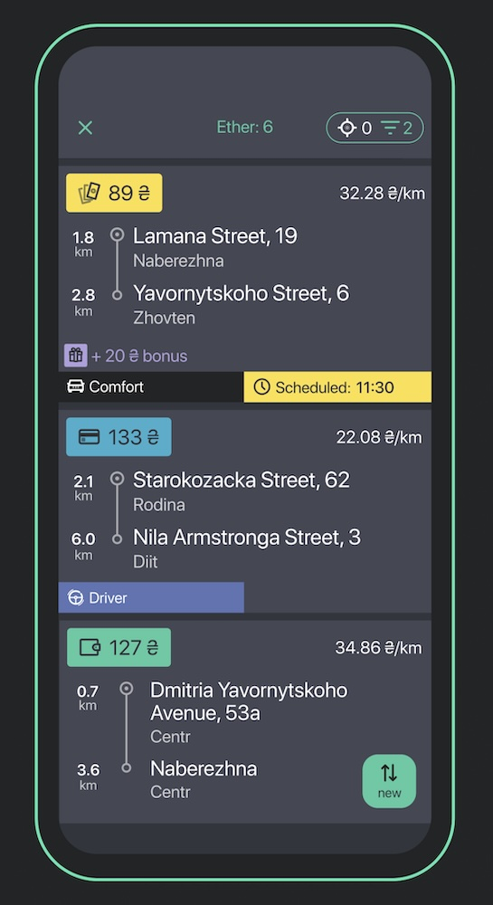

# RemoteAsyncOperation

## Задача
Полягає в отриманні від умовного бекенду результату асинхронної операції. 
Для конкретного прикладу, імітуємо сценарій прийняття ефірного замовлення застосунком [UklonDriver](https://apps.apple.com/ua/app/uklon-driver/id1249983946)

## Алгоритм, що необхідно реалізувати
- Мобільний застосунок ініціює запит на прийняття замовлення, відправляючи PUT-запит
- Цей запит може мати наступні результати: 
	- відповідь з результатом "замовлення прийнято", 
	- відповідь з результатом "замовлення не прийнято"
	- відповідь з результатом "результат операції ще невідомий"
	- помилка запиту з результатом "замовлення не прийнято"
	- інша помилка запиту (невідомо, чи сервер встиг взяти наш в запит роботу)
- Впродовж певного тайм-ауту застосунок чекає результату  операції по TCP (результат може бути як позитивний, так і негативний)
- В разі неотримання результату операції після тайм-ауту застосунок починає робити GET-запити на отримання результату операції з певними затримками між запитами. 
- Цей запит може мати наступні результати: 
	- відповідь з результатом "замовлення прийнято", 
	- відповідь з результатом "замовлення не прийнято"
	- відповідь з результатом "результат операції ще невідомий"
	- помилка запиту з результатом "замовлення не прийнято"
	- інша помилка запиту
- В разі отримання підтвердження прийняття замовлення, необхідно отримати його деталі окремим GET-запитом
- Цей запит може мати наступні результати: 
	- відповідь з деталями прийнятого замовлення
	- будь-яка помилка, запит необхідно повторити з затримкою

Робота з HTTP-сервером та канал отримання TCP-пакетів сховані за протоколами, відповідно, перевіряти правильність рішення будемо за допомогою моків і unit-тестів.

# Мета
Запропоноване рішення є демонстрацією практичного застосування наступних теоретичних концепцій:
- TDD
- Pure Functions
- Declarative Programming
- Functional Reactive Programming
- Reader-Writer Monad